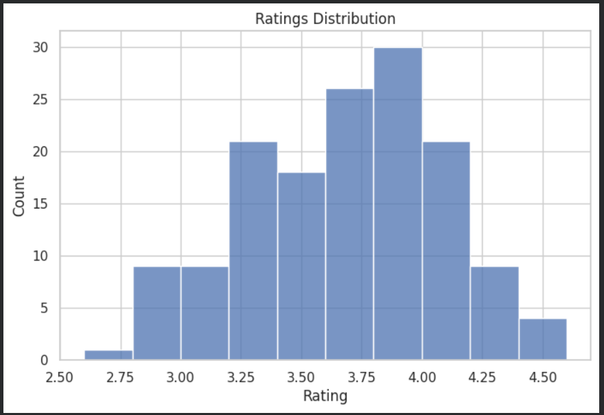
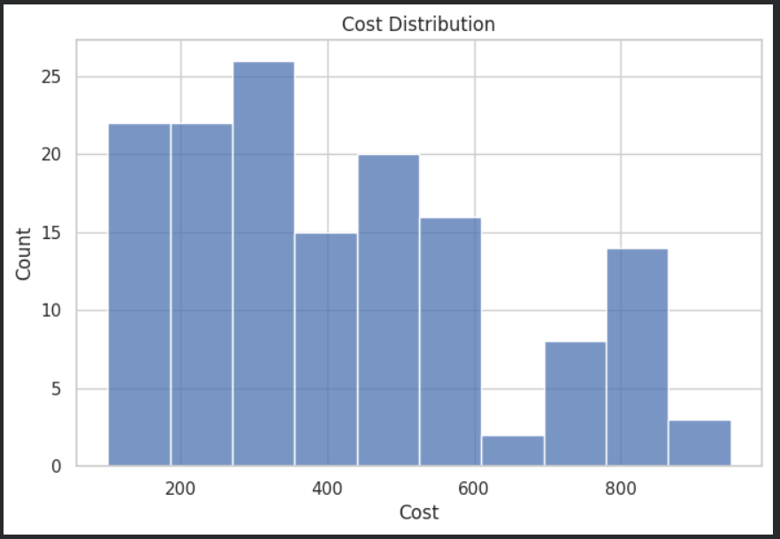
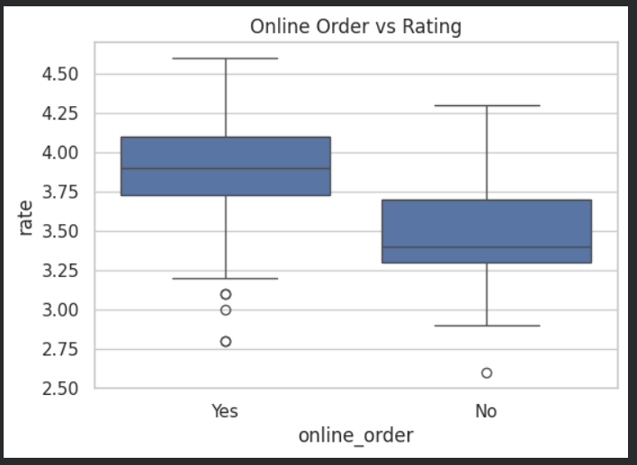
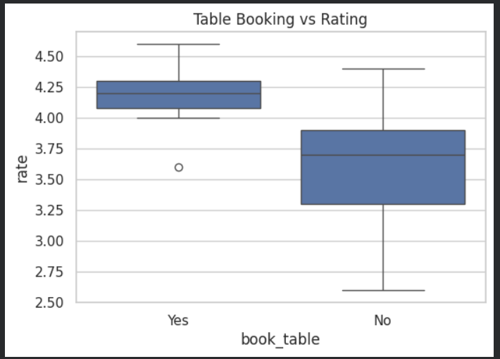
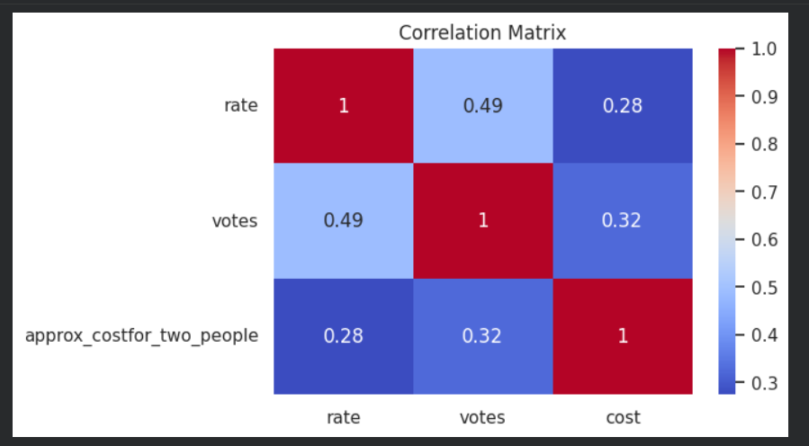

# Zomato Data Analysis

## 📌 Objective
To analyze Zomato restaurant data and extract insights related to ratings, cost, and customer preferences.

## 📊 Dataset
Zomato Bangalore Restaurants Dataset (Kaggle)

## 🛠 Tools Used
- Python
- Pandas
- NumPy
- Seaborn
- Matplotlib

## 🔍 Analysis Performed
- Data cleaning and preprocessing
- Handling missing values
- Removing duplicates
- Exploratory Data Analysis (EDA)
- Data visualization

## 📊 Visualizations
### Ratings Distribution

### Cost Distribution

### Online Order vs Rating

### Table Booking vs Rating

### Correlation Heatmap

## ❓ Business Questions Answered
- What is the distribution of restaurant ratings?
- Does online ordering affect ratings?
- Does table booking influence ratings?
- What is the cost distribution of restaurants?
- Which restaurant types are most common?

## 📈 Key Insights
- Most restaurants have ratings between 3.5 and 4.0.
- Restaurants offering online orders tend to have slightly higher ratings.
- Higher cost restaurants generally receive more votes.
- Majority of restaurants fall in the mid-price range.

## 📌 Conclusion
This analysis helps understand customer preferences and restaurant trends, which can support better decision-making for restaurant businesses.
